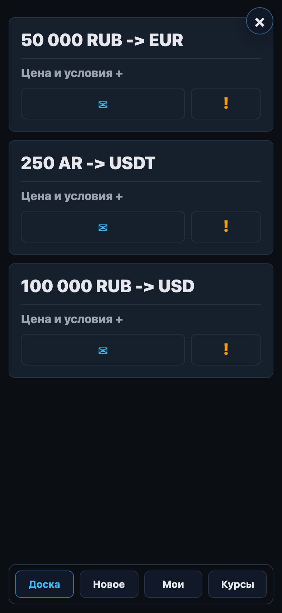
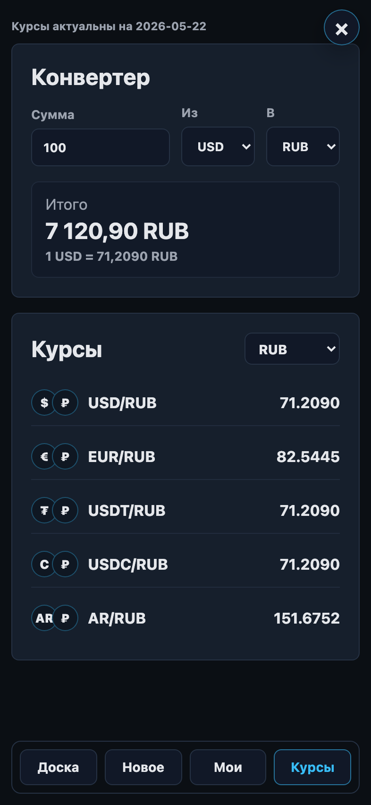
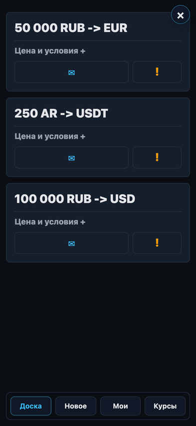

# FX Board

[](https://github.com/Mesteriis/fx-board/actions/workflows/ci.yml)
[](https://github.com/Mesteriis/fx-board/actions/workflows/pages.yml)
[](LICENSE)

FX Board is a Telegram Mini App classifieds board for currency buy/sell intent.
It is not an exchange, payment processor, escrow service, or custody product.

Project page: <https://mesteriis.github.io/fx-board/>

## Preview

| Board | Rates |
| --- | --- |
|  |  |



## Features

- Telegram Mini App / WebApp authentication through signed `initData`.
- FastAPI backend with PostgreSQL, Alembic migrations, server sessions, CSRF checks,
  rate limits, and admin endpoints.
- Nuxt 3 / Vue 3 SSR frontend optimized for a dark Telegram WebApp experience.
- aiogram 3 bot for app launch, commands, seller notifications, and deal follow-ups.
- Required Telegram channel access checks with cache and a feature flag.
- Classified ads for `USD`, `EUR`, `RUB`, `USDT`, `USDC`, and `AR`.
- Reference rates from Bank of Russia or ExchangeRate API fiat feeds plus Binance AR/USDT.
- Reports, moderation actions, audit log, and automatic ad hiding thresholds.

## Repository Layout

```text
backend/   FastAPI API, SQLAlchemy models, Alembic migrations, pytest suite
bot/       aiogram worker and bot command/follow-up tests
frontend/  Nuxt 3 SSR Telegram Mini App frontend
docker/    Dockerfiles, Compose file, reverse proxy notes, Postgres init scripts
site/      Static GitHub Pages project page
```

## Safety And Compliance

FX Board only publishes classified ads and notification messages. It does not
move funds, hold balances, guarantee counterparties, or provide legal, tax, AML,
or sanctions advice.

The bot messages intentionally remind users to describe real transaction facts
and comply with their local rules. Do not add guidance that encourages users to
hide the true nature of a transaction or mislead banks, platforms, counterparties,
or regulators.

## Requirements

- Docker and Docker Compose for the full stack.
- uv for Python dependency management in local validation and CI.
- Python 3.11 or 3.12 for backend and bot development.
- Node.js 20+ and npm for frontend development.
- A Telegram bot token for real bot/WebApp usage.

## Quick Start

```bash
cp .env.example .env
docker compose --env-file .env -f docker/compose.yml up -d db
API_PORT=18000 WEB_PORT=13000 docker compose --env-file .env -f docker/compose.yml up -d --build api web
curl -fsS http://localhost:18000/api/health
```

Open the frontend at `http://localhost:13000/`.

For local Nuxt development against the Docker API:

```bash
cd frontend
npm ci
NUXT_API_PROXY_TARGET=http://localhost:18000 npm run dev -- --port 3001
```

Development auth can be enabled with `DEV_AUTH_ENABLED=true` and a
`DEV_AUTH_TOKEN`; then open:

```text
/app?dev_tg_id=<telegram_id>&dev_token=<DEV_AUTH_TOKEN>
```

Never enable dev auth in production unless you explicitly set
`DEV_AUTH_ALLOW_PRODUCTION=true` for a temporary staging-style check.

## Configuration

Use `.env.example` as the source of documented settings. Important variables:

- `DATABASE_URL`: async SQLAlchemy URL for PostgreSQL.
- `TEST_DATABASE_URL`: PostgreSQL database used by backend tests.
- `TELEGRAM_BOT_TOKEN`: Telegram bot token. Never commit a real token.
- `TELEGRAM_REQUIRED_CHANNELS_ENABLED`: enables required channel enforcement.
- `RATES_PROVIDER`, `CBR_RATES_XML_URL`, `EXCHANGE_RATE_API_USD_URL`,
  `BINANCE_AR_USDT_TICKER_URL`: rate source config.
- `DEV_AUTH_ENABLED`, `DEV_AUTH_TOKEN`: guarded local auth bypass for development.

The Docker API container runs `alembic upgrade head` before starting Uvicorn.
The Compose Postgres service also creates `fx_board_test` for local tests on a
fresh volume.

## Validation

Backend:

```bash
docker compose --env-file .env -f docker/compose.yml up -d db
cd backend
uv sync --extra dev
uv run --extra dev ruff check .
uv run --extra dev pytest -q
```

Bot:

```bash
cd bot
uv sync --extra dev
uv run --extra dev ruff check .
uv run --extra dev pytest -q
```

Frontend:

```bash
cd frontend
npm ci
npm test
npm run build
```

## Deployment Notes

Recommended production topology:

- one public domain for frontend and API;
- `/` routed to Nuxt;
- `/api` routed to FastAPI;
- PostgreSQL kept private;
- bot worker connected to the API over the internal Docker network.

See [docker/reverse-proxy.md](docker/reverse-proxy.md) for one-domain reverse
proxy notes.

## Contributing

Issues and pull requests are welcome. Read [CONTRIBUTING.md](CONTRIBUTING.md)
before opening a PR.

## Security

Please do not file public issues for vulnerabilities. See [SECURITY.md](SECURITY.md).

## License

MIT. See [LICENSE](LICENSE).
